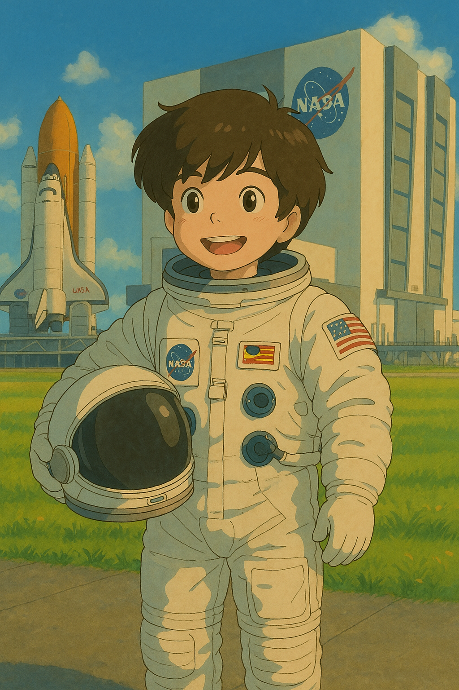
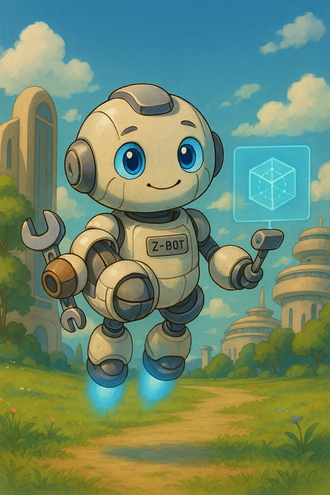

# DuduInSpace - The Cosmic Journey of a Little Hero 🚀🌌

Dudu had always been a curious and very intelligent child. Since he was little, he loved looking at the stars and imagining what it would be like to explore the universe. But he never imagined that, one day, Earth would really need him!

On a quiet night, while observing the sky with his telescope, Dudu noticed something strange: a shower of giant asteroids was approaching the planet. Scientists were desperate—there wasn't time to send a space mission. Humanity needed a hero... and that hero was Dudu!

With his brilliant mind and incredible skills, he rushes to his secret spaceship—a project he had been building in his backyard. Powered by advanced technology and equipped with plasma beam cannons, this ship was the only hope to save the planet.

Now, Dudu must traverse space, dodge debris, and destroy the asteroids before they hit Earth. But is this mission really that simple? Or is there something darker behind this asteroid shower?
The adventure is just beginning... 🌠

## Knowing more about our hero

</img>

### Dudu (The Young Hero)

**Race**: Human

**Class**: Tech Prodigy / Space Pilot

**Special ability**: Can quickly analyze and adapt alien technology

**Signature weapon**: Custom-built plasma beam pistol

**Weakness**: Sometimes overconfident in his calculations

***Key Characteristics***:
 - Age: 3 years old
 - Genius-level intellect
 - Self-taught engineer

 ## Allies

 

 ### Z-Bot

**Race**: AI Companion

**Class**: Support Drone

**Special ability**: Hacking alien technology

**Quirk**: Develops increasingly human-like personality

***Key Characteristics***:
- Dudu's self-made robot assistant
- Can transform into different tools
- Provides real-time analysis

### Professor Luna

**Race**: Human

**Class**: Mentor / Astrophysicist

**Special ability**: Can predict asteroid patterns

**Quirk**: Always carries a vintage star chart

***Key Characteristics***:
- Guides Dudu through scientific challenges
- Has a secret observatory laboratory
- Provides upgrades for Dudu's equipment