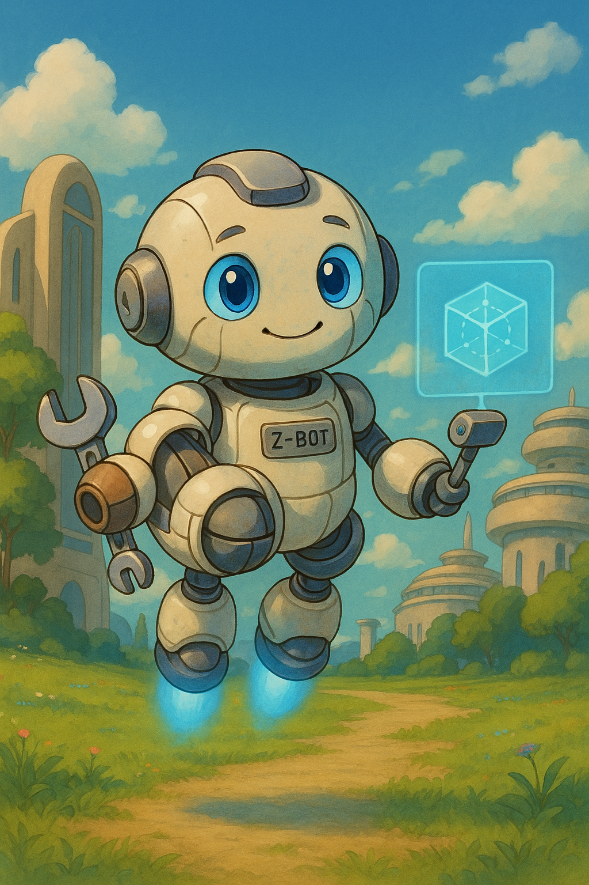

# DuduInSpace - A Jornada Cósmica de um Pequeno Herói 🚀🌌

Dudu sempre foi uma criança curiosa e muito inteligente. Desde pequeno, ele adorava olhar para as estrelas e imaginar como seria explorar o universo. Mas ele nunca imaginou que, um dia, a Terra realmente precisaria dele!

Em uma noite tranquila, enquanto observava o céu com seu telescópio, Dudu percebeu algo estranho: uma chuva de asteroides gigantes se aproximava do planeta. Os cientistas estavam desesperados — não havia tempo para enviar uma missão espacial. A humanidade precisava de um herói... e esse herói era o Dudu!

Com sua mente brilhante e habilidades incríveis, ele corre para sua espaçonave secreta — um projeto que vinha construindo em seu quintal. Movida por tecnologia avançada e equipada com canhões de feixe de plasma, essa nave era a única esperança para salvar o planeta.

Agora, Dudu deve atravessar o espaço, desviar de destroços e destruir os asteroides antes que atinjam a Terra. Mas essa missão é realmente tão simples? Ou há algo mais sombrio por trás dessa chuva de asteroides?

A aventura está apenas começando... 🌠

## Conhecendo melhor nosso herói

</img>

### Dudu (O Jovem Herói)

**Raça**: Humano

**Classe**: Prodígio Tecnológico / Piloto Espacial

**Habilidade especial**: Capacidade de analisar e adaptar rapidamente tecnologia alienígena

**Arma característica**: Pistola de feixe de plasma construída sob medida

**Fraqueza**: Às vezes fica confiante demais em seus cálculos

***Principais Características***:
- Idade: 3 anos
- Intelecto de nível genial
- Engenheiro autodidata

## Aliados

### Z-Bot

**Raça**: Companheiro de IA

**Classe**: Drone de Suporte

**Habilidade especial**: Invadir tecnologia alienígena

**Peculiaridade**: Desenvolve personalidade cada vez mais humana

***Principais Características***:
- Assistente robótico feito pelo próprio Dudu
- Pode se transformar em diferentes ferramentas
- Fornece análise em tempo real

### Professora Luna

**Raça**: Humana

**Classe**: Mentora / Astrofísica

**Habilidade especial**: Capacidade de prever padrões de asteroides

**Peculiaridade**: Carrega sempre um mapa estelar vintage

***Principais Características***:
- Guia Dudu em desafios científicos
- Possui um laboratório observatório secreto
- Fornece melhorias para o equipamento de Dudu 